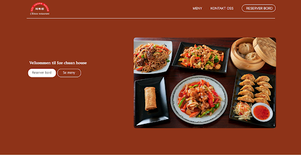

# DAT251-project



This project is a Single Page Application (SPA) and booking system designed for a local restaurant. 
It allows customers to view restaurant information, browse the menu, see available booking times and create reservations through the booking system. Additionally, the system’s algorithm for assigning 
guests to tables were based on the restaurant layout and booking constraints.

## Installation and Usage
Clone github repo
To run application you have to first run the backend:  

**On MAC**  
```
gradle bootrun
```  
**On Windows**
```
.\gradlew.bat bootrun
```

Then, to run frontend, navigate to the fronted 
folder and execute following commands:  
```
npm install
```
and then run:  
```
npm run dev
```

To access website, Next.js runs on `localhost:3000` by default. 

